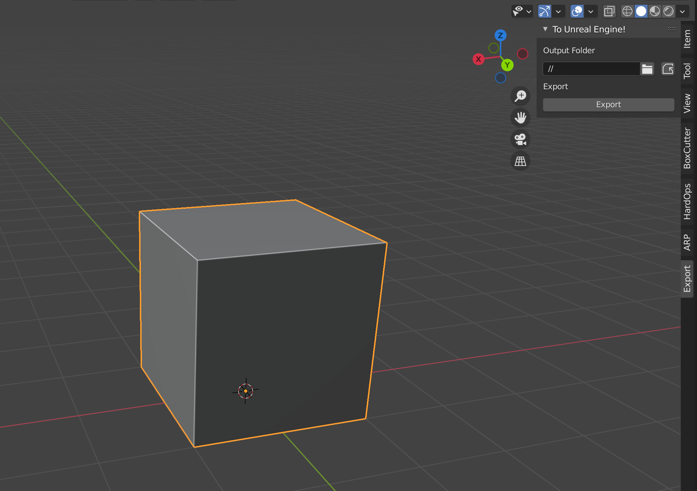

# Blender-To-Unreal-Engine

An extremely light-weight add-on that makes it really easy to quickly export simple static FBX models to unreal engine.

This isn't designed to export any sort of armature or character rig, but more-so static objects.

## Usage

Simply select your objects, and hit `export`! Make sure you select your correct output folder location in your Unreal Engine Project folder.

## Notes

This works as of `January 2022`. Feel free to give it a try!